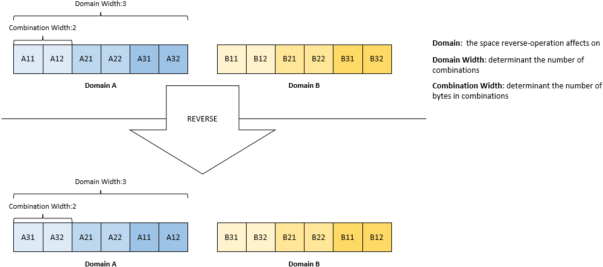

# BReorder
Beyond Bytes Reorder

## 1 Functions

- Reordering bytes in binary file
- Transforming binary file into text file
- Transforming text file into binary file
### 1.2



### 1.3 Operation Flow
```c
inline void run(){
    //phaser

    //checker

    //deal loop
        //reader
        //reverser
        //writer
    //deal loop end

};
```
## 2 Usage

### 2.1 Default 
- *brd [fileDir/fileName.suffix]*

default value of parameters:
| Element width | Combination width |
| :---: | :---: |
|1 Bytes | 4 Element |

*ex:*
- *brd ./a.bin*

the effect of this command is just as below:

| input | output |
| :---: | :---: |
| 0x12345678 | 0x87654321 | 

### 2.2 Assign Element width
you can assign n-bytes combination as follows
- *brd -E [n] [fileDir/fileName.suffix]*\
number should be an arabic figures less than the size of input file

### 2.4 Assign Combination width
n-bytes combination as follows
- *brd -C [n]* [fileDir/fileName.suffix]

### 2.3 To text
Transforming into text file
- *brd -t [fileDir/fileName.suffix]*

## 3 Ouput

### 3.1 Binary
*fileDir/fileName_[parameters].suffix*

### 3.2 Text
*fileDir/fileName_[parameters].txt*

### 3.3 parameters
if using command *brd -n 4 -t*\
[parameters] should be 4_t, then the output file should be *fileDir/filename_n4_t.txt*

## 4 Notice
- ...

## 5 Make contribution
- ...
