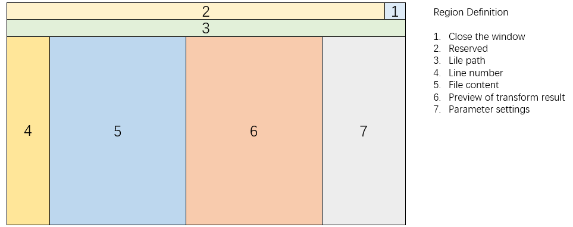
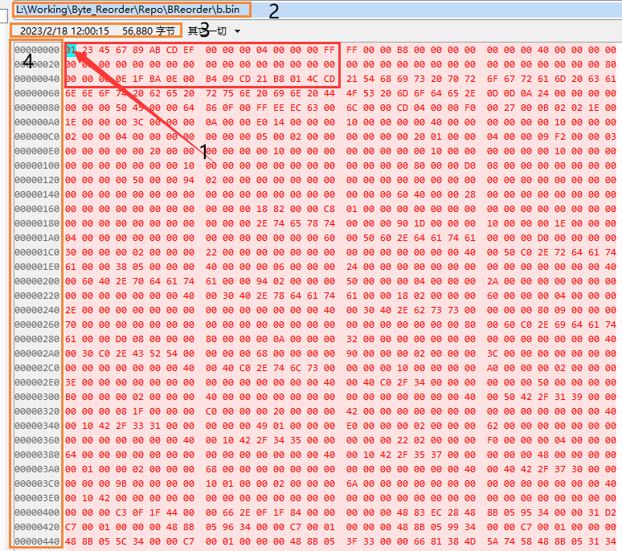

## 图形界面需求

## 1 功能区域划分

GUI界面功能区域划分（暂）

1. 关闭窗口
2. 保留
3. 文件路径
4. 行号
5. 文件内容
6. 预览转换结果
7. 参数设置

## 2 进度
### 2.1 进度任务表
| 日期 | 需求 | 进度 |
| --- | --- |--- |
| 20230225 | 第一阶段做技术验证，只需要实现上图中区域1和5的功能即可（即设计一个界面，可以查看指定二进制文件的内容） | 委托给ly做验证 |
### 2.1 样式参考
文件内容（区域5）显示效果参考下图红框中样式

